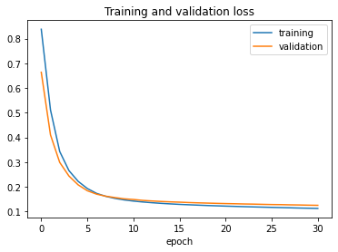
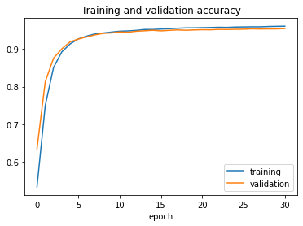
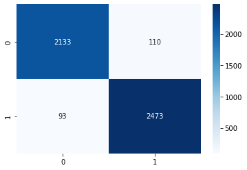
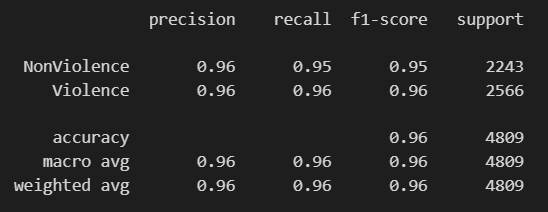

# Violence Situations Detection

## Overview
This project implements a deep learning-based violence detection system that processes video footage to detect violent situations. The model analyzes video frames in real time and classifies them as violent or non-violent, displaying the results on the video and saving the output.

## Features
- Loads a trained TensorFlow/Keras model for violence detection.
- Processes video files or webcam streams.
- Displays real-time predictions with annotations.
- Saves the processed video with detected violence annotations.

## Installation
### Prerequisites
Ensure you have the following installed:
- Python 3.x
- OpenCV (`cv2`)
- TensorFlow/Keras
- NumPy

### Install Dependencies
```sh
pip install opencv-python numpy tensorflow
```


### Input Options
- Change the input source in `cap = cv2.VideoCapture()` inside the script:
  - Use `0` for the webcam.
  - Provide a file path for pre-recorded videos.
  - Use an IP camera URL.

### Output
- The script will display the video with real-time predictions.
- Processed video will be saved as `output.avi`.

## Example Output
Here are some examples of detected violence situations:

### Video Outputs
[]
[]

## Model Performance and Charts
Below are performance charts for the trained model:

### Accuracy & Loss Graphs






## Model Training
The model used in this project was trained using a dataset of violent and non-violent videos. If you wish to retrain the model, provide a labeled dataset and use TensorFlow/Keras for training.

## Contributing
Feel free to open issues or submit pull requests for improvements.

## License
This project is licensed under the MIT License.


